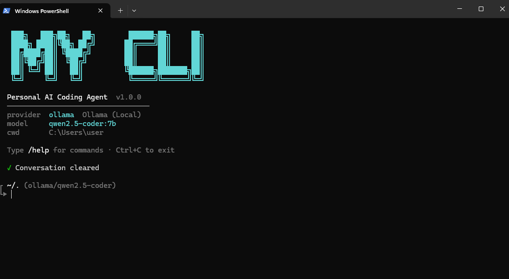

# cloii-cli

> Personal AI coding agent — runs locally or on free cloud tiers. No subscriptions.

Built from scratch for my own workflow. Supports Ollama (local/offline), Groq (free tier, fast), and OpenRouter (free models). Modern CLI with Rich UI and Desktop GUI.

## New Features (v1.1.0)

- Modern UI with Rich library — Beautiful panels, tables, and styled text
- Syntax highlighting — Code blocks with auto-language detection  
- Performance improvements — Async-safe spinners and optimized rendering
- Enhanced status display — Professional table-based information layout
- Better error handling — Styled messages with visual hierarchy

## Screenshots

**Note:** Screenshots below are from an earlier version. The CLI now has a modern Rich UI with better styling.



---

## Features

- Agent loop — AI reads files, writes code, runs commands, searches the web autonomously
- 7 built-in tools — bash, read_file, write_file, edit_file, list_files, web_fetch, web_search
- 3 providers — Ollama (local), Groq (free), OpenRouter (free)
- Modern CLI — Rich library with syntax highlighting and professional styling
- Desktop GUI — Electron + React terminal-style interface
- Lightweight — Minimal dependencies (Rich + Pygments)
- Session management — Save and load your conversations

---

## Quick Start

### Requirements
- Python 3.10+
- Ollama (https://ollama.com) for local models
- Node.js 18+ (for desktop GUI only)

### CLI Installation

```bash
git clone https://github.com/Cloii/cloii-cli.git
cd cloii-cli
pip install -e .
```

### Using Ollama (Local/Offline)

```bash
# Make sure Ollama is running first
mycli

# Or specify a model
mycli --model qwen2.5-coder:7b --provider ollama
```

### Using Groq (Free Tier - Very Fast)

```bash
export GROQ_API_KEY=your_key_here
mycli --provider groq --model llama-3.3-70b-versatile
```

### Using OpenRouter (Free Models)

```bash
export OPENROUTER_API_KEY=your_key_here
mycli --provider openrouter --model meta-llama/llama-3.3-70b-instruct:free
```

### Desktop GUI

```bash
cd desktop
npm install
npm run dev
```

---

## CLI Options

```bash
mycli --help              # Show help
mycli                     # Start interactive session
mycli --model MODEL       # Use specific model
mycli --provider PROVIDER # Use specific provider (ollama, groq, openrouter)
mycli --debug             # Enable debug output
mycli --server            # Run in JSON server mode for desktop GUI
```

---

## Slash Commands

| Command | Description |
|---------|-------------|
| `/help` | Show all commands |
| `/provider [name]` | Switch provider (ollama, groq, openrouter) |
| `/model [name]` | Switch model |
| `/models` | List available models for current provider |
| `/status` | Show current config and connection status |
| `/clear` | Clear conversation history |
| `/save [file]` | Save session to JSON (default: session.json) |
| `/load [file]` | Load session from JSON file |
| `/cd [path]` | Change working directory |
| `/pwd` | Show current directory |
| `/exit` | Quit the CLI |

---

## Providers and Free Models

### Ollama (Local, Always Free)
- Best for: Privacy, offline use, no API costs
- Setup: Download from ollama.com
- Models: qwen2.5-coder:7b, llama3.2:3b, gemma3:4b, phi4-mini
- Requirements: Run `ollama serve` before using

### Groq (Free Tier - Very Fast)
- Best for: Speed, free tier generosity
- Setup: Get API key at console.groq.com
- Models: llama-3.3-70b-versatile, llama-3.1-8b-instant, gemma2-9b-it
- Free tier: Very generous quota

### OpenRouter (Free Models)
- Best for: Model variety, free tier support
- Setup: Get API key at openrouter.ai
- Models: Meta Llama 3.3, Google Gemma 3, Mistral, Qwen 3
- Free tier: Limited but available

---

## Tools the Agent Can Use

| Tool | What it does |
|------|-------------|
| bash | Run shell commands and get output |
| read_file | Read any file (code, text, markdown, etc.) |
| write_file | Create or overwrite files |
| edit_file | Find-and-replace text in files |
| list_files | Browse directory contents |
| web_fetch | Fetch and parse web pages |
| web_search | Search DuckDuckGo (no API key needed) |

---

## Example Usage

### Ask it to code something
```
> Create a Python script that fetches the latest weather and displays it

[Agent runs tools to search for weather APIs, creates a script, tests it]
```

### Navigate your codebase
```
> /cd src
~/code/project/src > Summarize what's in this directory
```

### Manage sessions
```
> /save my-session.json
Saved to my-session.json

> /load my-session.json
Loaded 42 messages from my-session.json
```

### Switch providers on the fly
```
> /provider groq
Switched to groq with model llama-3.3-70b-versatile

> /model llama-3.1-8b-instant
Model set to llama-3.1-8b-instant
```

---

## Architecture

- agent.py — Main agent loop with tool execution
- cli.py — Interactive CLI with Rich UI
- cli_ui.py — UI theme and components (new in v1.1.0)
- providers/ — Provider implementations (Ollama, Groq, OpenRouter)
- tools/ — Tool definitions and execution
- config.py — Configuration management
- server.py — JSON API for desktop GUI

---

## Configuration

Configuration is stored in ~/.config/cloii-cli/config.json

```json
{
  "provider": "ollama",
  "model": "qwen2.5-coder:7b",
  "ollama_host": "http://localhost:11434",
  "debug": false,
  "max_tokens": 4096
}
```

Change provider or model anytime with `/provider` and `/model` commands.

---

## Keyboard Shortcuts

- Ctrl+C — Interrupt current operation
- Ctrl+D or Ctrl+Z (Windows) — Exit CLI
- Up/Down Arrow — Browse command history

---

## Troubleshooting

### "Provider init failed"
- Ollama: Make sure Ollama is running (ollama serve)
- Groq/OpenRouter: Check your API key is set as environment variable

### "Max iterations reached"
Agent could not complete the task. Try:
- Simpler, more specific requests
- Use /clear to start fresh
- Check agent output with --debug flag

### Slow responses
- Ollama: Running on CPU? Switch to a smaller model
- Groq: Fastest free option for quick responses
- OpenRouter: Check available free models with /models

---

## License

MIT — Feel free to fork, modify, and use for your own projects.

---

## Future Roadmap

- Multi-turn conversation memory improvements
- Custom tool definitions
- Plugin system
- Vision capabilities
- Better error recovery

---

Created for developers who want AI tools that work their way.


## Project Structure

```
cloii-cli/
├── cloii_cli/
│   ├── __main__.py      # Entry point
│   ├── cli.py           # REPL + slash commands
│   ├── agent.py         # Agent loop (LLM ↔ tools)
│   ├── config.py        # Configuration
│   ├── server.py        # JSON server for desktop
│   ├── providers/
│   │   ├── ollama.py    # Ollama adapter
│   │   └── openai_compat.py  # Groq / OpenRouter
│   └── tools/
│       └── __init__.py  # All 7 tools
├── desktop/
│   ├── electron/        # Electron main + preload
│   └── src/             # React UI
└── pyproject.toml
```

---

## License

MIT — built by Cloii
